# ML-project3-E-mail-Spam-Filter


A machine learning project for spam email classification using Naive Bayes.

---

## 🚀 Project Overview

This repository contains a simple spam filter built using the Naive Bayes algorithm. The project demonstrates how machine learning can be applied to classify emails as spam or non-spam (ham) based on their content.

---

## 📂 Contents

| File/Folder                  | Description                                             |
|------------------------------|--------------------------------------------------------|
| `Project 6 - Spam Classifier Using Naive Bayes.pptx`   | Project presentation slides                             |
| `Project 6 - Spam Classifier using Naive Bayes.ipynb`  | Jupyter Notebook with code & explanations               |
| `emails.csv`                 | Dataset containing labeled emails                      |
| `LICENSE`                    | License information for this repository                |
| `README.md`                  | This file                                              |

---

## ⚙️ Flowchart

Below is a simple flowchart illustrating the spam filtering process:

```mermaid
flowchart TD
    A[Start] --> B[Load Dataset 📥]
    B --> C[Preprocess Data 🧹]
    C --> D[Vectorize Text 🔢]
    D --> E[Train Naive Bayes Model 🤖]
    E --> F[Predict on Test Data 💡]
    F --> G[Evaluate Performance 📊]
    G --> H[End]
```



---

## 💻 Getting Started

1. **Clone the repository:**
   ```bash
   git clone https://github.com/mdzaheerjk/ML-project3-E-mail-Spam-Filter.git
   ```

2. **Open the Jupyter Notebook:**
   - Make sure you have Python and Jupyter installed.
   - Open `Project 6 - Spam Classifier using Naive Bayes.ipynb` to view and run the code.

3. **Run the cells:**
   - Follow the instructions in the notebook to load the data, preprocess it, train the model, and evaluate its performance.

---

## 🧰 Requirements

- 
- 
- 

Install dependencies with:
```bash
pip install pandas scikit-learn notebook
```

---

## 🏆 Results

- The classifier achieves good accuracy in distinguishing spam from non-spam emails.
- Try experimenting with different preprocessing and model tuning techniques to improve performance.

---

## 📄 License

This project is licensed under the [MIT License](LICENSE).

---

## 👤 Author

**mdzaheerjk**

---

Feel free to fork this repository and improve the spam filter or apply it to other text classification problems!
